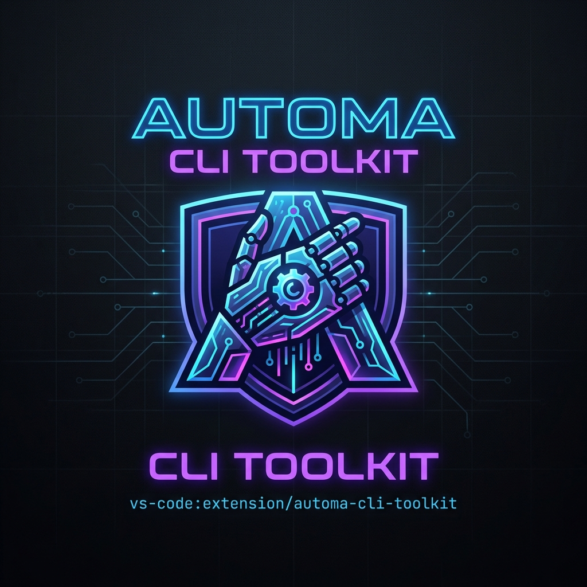

  
  <h1>Automa CLI Toolkit</h1>
  
<strong>The ultimate visual orchestration engine for your automated browser workflows inside VS Code.</strong>

  
  

    
    
    
  

  

 

**Automa CLI Toolkit** transforms VS Code into a centralized command center for the entire Automa Ecosystem. Say goodbye to raw JSON files. Design, manage, schedule, and execute your browser automation fleets with gorgeous visual editors and zero-dependency Chromium integration.

---

## 🚀 Features That Wow

### 🎨 Custom Visual Editors
No more staring at raw `.json` files! Click on any Automa file to experience our bespoke visual editors:
- **Workflow Preview (`*.automa.json`)**: Interactively set trigger parameters, modify global data, and edit metadata before launching your script.
- **Fleet Manager (`*.fleets.json`)**: Visually orchestrate parallel execution, map browser profiles, and schedule cron jobs effortlessly.
- **Log Viewer (`*.automa-log.json`)**: Dive into a beautiful timeline-based execution log. Filter by success/failure and drill down into individual block data.

*(Insert GIF Demo here: Quick Edit to Run Workflow)*

### ⚡ Lightning Fast Execution
- Run workflows directly from the editor title bar or the Explorer context menu.
- Triggers the isolated `automa-cli` engine using native Chrome APIs (MV3) with anti-detection Puppeteer CDP polling.
- Zero `webextension-polyfill` crash issues! Fully compatible with Chrome 129+.

### 📊 Sidebar Control Center
Monitor your automation empire with the dedicated Activity Bar:
- **Runners**: Live telemetry of all active daemon processes. One-click to kill or view real-time logs.
- **Profiles & Fleets**: Browse and search your entire workspace's browser profiles and orchestration fleets.

### 🛡️ Smart Linter & Auto-Fix
Imported a workflow from the community with broken `n1` IDs? 
- Right-click and choose **Auto-Fix Workflow ID** to instantly sanitize nodes and edges with valid 21-char NanoIDs.
- Real-time **Linting** integrates directly into the VS Code Problems panel to catch schema deviations before execution.

---

## ⚙️ Configuration

Tune the execution engine to your needs via VS Code Settings (`Ctrl + ,` -> search `automa`):

| Setting | Description | Default |
|---|---|---|
| `automa.vault.run.defaultBrowser` | The isolated browser to use (`chromium`, `chrome`, `edge`, `firefox`). | `chromium` |
| `automa.vault.run.headless` | Run browser invisibly in the background. | `false` |
| `automa.run.useDefaultParameters` | Skip interactive prompts and auto-run using default parameters. | `false` |
| `automa.preview.defaultOnClick` | Open `.automa.json` files in the Visual Editor by default. | `true` |

*(Pro Tip: Create a `.vscode/settings.json` to define `automa.vault.run.globalVariables` for your specific workspace!)*

---

## 🛠 System Requirements
- Visual Studio Code `>= 1.80.0`
- Node.js 18+ (for local CLI execution)

## 🤝 Community & Support
Love the extension? Give it an upvote on Product Hunt and a star on GitHub!
- **Documentation:** Check out the comprehensive Obsidian Vault in our repository.
- **Report Bugs:** Open an issue on GitHub.
